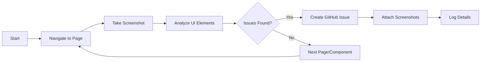
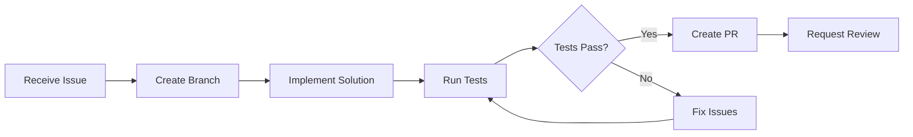

# Multi-Agent Development System Design for Nuptul

## Executive Summary

This document outlines a comprehensive multi-agent development system for the Nuptul project, building upon the existing infinite-agentic-loop framework. The system enables parallel development with multiple AI agents working simultaneously on different aspects of the codebase, with real-time monitoring and intelligent orchestration.

## System Architecture Overview

### Core Components

```
┌─────────────────────────────────────────────────────────────────┐
│                    Observability Dashboard                       │
│  ┌─────────────┐ ┌──────────────┐ ┌─────────────┐ ┌──────────┐│
│  │Agent Status │ │Issue Tracking│ │Deploy Status│ │ Metrics  ││
│  └─────────────┘ └──────────────┘ └─────────────┘ └──────────┘│
└─────────────────────────────────────────────────────────────────┘
                               ▲
                               │
┌─────────────────────────────────────────────────────────────────┐
│                      Orchestrator Agent                          │
│  ┌──────────────┐ ┌───────────────┐ ┌──────────────────────┐  │
│  │Issue Router  │ │Agent Manager  │ │Conflict Resolution  │  │
│  └──────────────┘ └───────────────┘ └──────────────────────┘  │
└─────────────────────────────────────────────────────────────────┘
        ▲                      ▲                        ▲
        │                      │                        │
┌───────┴──────┐      ┌───────┴──────┐       ┌────────┴─────────┐
│Testing Agent │      │ Dev Agent 1  │       │  Dev Agent N     │
│  - Browser   │      │  - Feature   │       │  - Bug Fix       │
│  - Screenshot│      │  - Branch    │       │  - Branch        │
│  - Analysis  │      │  - PR        │       │  - PR            │
└──────────────┘      └──────────────┘       └──────────────────┘
        │                      │                        │
        └──────────────────────┴────────────────────────┘
                               │
                        ┌──────▼──────┐
                        │   GitHub    │
                        │ Repository  │
                        └─────────────┘
```

## Detailed Component Design

### 1. GitHub Repository Structure

```
nuptul-production/
├── .github/
│   ├── workflows/
│   │   ├── agent-ci.yml              # Agent-specific CI/CD
│   │   ├── deploy-netlify.yml        # Production deployment
│   │   ├── test-automation.yml       # Automated testing
│   │   └── orchestrator.yml          # Orchestrator workflows
│   ├── agents/
│   │   ├── testing/
│   │   │   ├── config.json           # Testing agent config
│   │   │   └── scripts/              # Test scripts
│   │   ├── development/
│   │   │   ├── agent-template.json   # Dev agent template
│   │   │   └── skills/               # Agent capabilities
│   │   └── orchestrator/
│   │       ├── router.json           # Issue routing rules
│   │       └── policies.json         # Agent policies
│   └── ISSUE_TEMPLATE/
│       ├── bug_report.yml
│       ├── feature_request.yml
│       └── ui_issue.yml
├── src/                               # Production source code
├── public/                            # Static assets
├── agent-workspace/                   # Agent working directories
│   ├── testing/                       # Testing agent workspace
│   ├── dev-agent-1/                  # Dev agent workspaces
│   └── dev-agent-n/
├── observability/
│   ├── config/                        # Dashboard configuration
│   ├── metrics/                       # Custom metrics
│   └── alerts/                        # Alert rules
├── docs/
│   ├── agent-guide.md
│   ├── architecture.md
│   └── troubleshooting.md
└── scripts/
    ├── setup-agents.sh
    └── deploy-dashboard.sh
```

### 2. Multi-Agent System Components

#### 2.1 Testing Agent

**Purpose**: Automated UI testing and issue detection

**Capabilities**:
- Browser automation using MCP browser tools
- Screenshot capture at each interaction
- Visual regression testing
- Accessibility testing
- Performance metrics collection

**Workflow**:


**MCP Tools Used**:
- `mcp__docker-mcp__browser_navigate`
- `mcp__docker-mcp__browser_take_screenshot`
- `mcp__docker-mcp__browser_snapshot`
- `mcp__docker-mcp__create_issue`
- `mcp__docker-mcp__browser_use_agent`

#### 2.2 Development Agents

**Purpose**: Parallel feature development and bug fixes

**Capabilities**:
- Branch creation and management
- Code generation and modification
- Pull request creation
- Automated testing
- Conflict resolution assistance

**Agent Types**:
1. **Feature Agents**: Work on new features
2. **Bug Fix Agents**: Address reported issues
3. **Refactor Agents**: Code improvements
4. **Documentation Agents**: Update docs

**Workflow**:


#### 2.3 Orchestrator Agent

**Purpose**: Coordinate all agents and manage workflows

**Capabilities**:
- Issue categorization and routing
- Agent lifecycle management
- Conflict detection and resolution
- Resource allocation
- Progress monitoring

**Core Functions**:

```python
class OrchestratorAgent:
    def route_issue(self, issue):
        """Route issues to appropriate agents based on labels and content"""
        if "bug" in issue.labels:
            return self.assign_to_bug_agent(issue)
        elif "feature" in issue.labels:
            return self.assign_to_feature_agent(issue)
        elif "ui" in issue.labels:
            return self.assign_to_frontend_agent(issue)
    
    def manage_conflicts(self):
        """Detect and resolve merge conflicts between agent branches"""
        active_branches = self.get_active_agent_branches()
        for branch in active_branches:
            if self.has_conflicts(branch):
                self.initiate_conflict_resolution(branch)
    
    def allocate_resources(self):
        """Distribute work based on agent availability"""
        available_agents = self.get_available_agents()
        pending_issues = self.get_pending_issues()
        return self.optimize_assignment(available_agents, pending_issues)
```

### 3. Agent Communication Protocol

#### 3.1 Message Format

```json
{
  "agent_id": "dev-agent-001",
  "timestamp": "2024-01-15T10:30:00Z",
  "type": "status_update",
  "payload": {
    "issue_id": 42,
    "status": "in_progress",
    "progress": 75,
    "branch": "feature/agent-001-user-auth",
    "estimated_completion": "2024-01-15T11:00:00Z"
  }
}
```

#### 3.2 Communication Channels

1. **GitHub API**: Primary communication via issues, PRs, and comments
2. **WebSocket**: Real-time status updates to dashboard
3. **Event Bus**: Inter-agent messaging for coordination
4. **File-based**: Shared state in agent-workspace

### 4. Observability Dashboard

#### 4.1 Technology Stack

- **Frontend**: React + TypeScript (matching Nuptul)
- **Backend**: Node.js + Express
- **Real-time**: WebSocket (Socket.io)
- **Database**: PostgreSQL (via Supabase)
- **Monitoring**: Custom metrics + Langfuse integration

#### 4.2 Dashboard Features

```typescript
interface DashboardFeatures {
  // Real-time Agent Status
  agentStatus: {
    active: Agent[];
    idle: Agent[];
    failed: Agent[];
    metrics: AgentMetrics;
  };
  
  // Issue Tracking
  issueTracking: {
    open: Issue[];
    inProgress: Issue[];
    resolved: Issue[];
    assignmentMap: Map<Issue, Agent>;
  };
  
  // Deployment Pipeline
  deployment: {
    currentVersion: string;
    pendingDeploys: Deploy[];
    history: DeployHistory[];
    rollbackCapability: boolean;
  };
  
  // Performance Metrics
  metrics: {
    issueResolutionTime: number;
    agentEfficiency: number;
    codeQuality: QualityMetrics;
    testCoverage: number;
  };
}
```

#### 4.3 Dashboard Layout

```
┌─────────────────────────────────────────────────────────────────┐
│ Nuptul Multi-Agent Dashboard                    [Settings] [Help]│
├─────────────────────────────────────────────────────────────────┤
│ ┌─────────────────┐ ┌─────────────────┐ ┌────────────────────┐ │
│ │ Active Agents: 5│ │Issues Open: 12  │ │Deploy Status: Live│ │
│ └─────────────────┘ └─────────────────┘ └────────────────────┘ │
├─────────────────────────────────────────────────────────────────┤
│ Agent Activity Timeline                                          │
│ ┌──────────────────────────────────────────────────────────────┐│
│ │ [10:30] Testing-Agent: Found UI issue #43                    ││
│ │ [10:31] Orchestrator: Assigned #43 to Dev-Agent-002         ││
│ │ [10:32] Dev-Agent-002: Created branch fix/issue-43          ││
│ │ [10:45] Dev-Agent-002: PR #156 ready for review             ││
│ └──────────────────────────────────────────────────────────────┘│
├─────────────────────────────────────────────────────────────────┤
│ Issue Assignment Matrix                                          │
│ ┌──────────────────────────────────────────────────────────────┐│
│ │ Agent          │ Current Issue │ Status      │ ETA          ││
│ │ Dev-Agent-001  │ #41 Feature   │ In Progress │ 15 min       ││
│ │ Dev-Agent-002  │ #43 Bug       │ Testing     │ 5 min        ││
│ │ Dev-Agent-003  │ Idle          │ Available   │ -            ││
│ └──────────────────────────────────────────────────────────────┘│
└─────────────────────────────────────────────────────────────────┘
```

### 5. GitHub Workflows

#### 5.1 Agent CI/CD Pipeline

```yaml
# .github/workflows/agent-ci.yml
name: Agent CI/CD Pipeline

on:
  pull_request:
    types: [opened, synchronize]
  
jobs:
  validate-agent-work:
    runs-on: ubuntu-latest
    steps:
      - uses: actions/checkout@v3
      
      - name: Identify Agent
        id: agent
        run: |
          echo "agent_id=$(echo ${{ github.head_ref }} | cut -d'/' -f2)" >> $GITHUB_OUTPUT
      
      - name: Run Agent-Specific Tests
        run: |
          npm run test:agent -- --agent=${{ steps.agent.outputs.agent_id }}
      
      - name: Code Quality Check
        run: |
          npm run lint
          npm run type-check
      
      - name: Security Scan
        uses: github/super-linter@v4
      
      - name: Update Agent Status
        run: |
          curl -X POST ${{ secrets.DASHBOARD_URL }}/api/agent/status \
            -H "Authorization: Bearer ${{ secrets.AGENT_TOKEN }}" \
            -d '{"agent_id": "${{ steps.agent.outputs.agent_id }}", "status": "tests_complete"}'
```

#### 5.2 Orchestrator Workflow

```yaml
# .github/workflows/orchestrator.yml
name: Orchestrator Management

on:
  issues:
    types: [opened, labeled]
  schedule:
    - cron: '*/15 * * * *'  # Every 15 minutes

jobs:
  route-new-issues:
    if: github.event_name == 'issues'
    runs-on: ubuntu-latest
    steps:
      - name: Analyze Issue
        uses: ./.github/actions/analyze-issue
        with:
          issue_number: ${{ github.event.issue.number }}
      
      - name: Assign to Agent
        uses: ./.github/actions/assign-agent
        with:
          issue_number: ${{ github.event.issue.number }}
          agent_pool: ${{ secrets.AGENT_POOL }}
  
  health-check:
    if: github.event_name == 'schedule'
    runs-on: ubuntu-latest
    steps:
      - name: Check Agent Health
        run: |
          python scripts/check_agent_health.py
      
      - name: Rebalance Workload
        if: failure()
        run: |
          python scripts/rebalance_agents.py
```

### 6. Implementation Phases

#### Phase 1: Foundation (Week 1-2)
1. Set up GitHub repository structure
2. Configure basic CI/CD pipelines
3. Implement authentication system
4. Create agent workspace directories

#### Phase 2: Core Agents (Week 3-4)
1. Develop Testing Agent with MCP browser tools
2. Create Orchestrator Agent logic
3. Build first Development Agent
4. Implement basic communication protocol

#### Phase 3: Integration (Week 5-6)
1. Connect agents via GitHub API
2. Set up real-time dashboard
3. Implement issue routing system
4. Create conflict resolution mechanisms

#### Phase 4: Enhancement (Week 7-8)
1. Add more specialized agents
2. Implement advanced orchestration
3. Optimize performance
4. Add learning capabilities

### 7. Security & Safety Measures

#### 7.1 Agent Permissions

```json
{
  "testing_agent": {
    "github": ["issues:write", "contents:read"],
    "mcp": ["browser:all", "screenshots:write"],
    "branches": ["testing/*"]
  },
  "dev_agent": {
    "github": ["contents:write", "pull_requests:write", "issues:read"],
    "mcp": ["file:write", "git:all"],
    "branches": ["feature/*", "fix/*"]
  },
  "orchestrator": {
    "github": ["admin:org", "issues:write"],
    "mcp": ["all"],
    "branches": ["*"]
  }
}
```

#### 7.2 Safety Mechanisms

1. **Branch Protection**: Main branch requires reviews
2. **Automated Rollback**: On critical failures
3. **Resource Limits**: CPU/memory caps per agent
4. **Audit Logging**: All agent actions logged
5. **Sandboxing**: Agents run in isolated environments

### 8. Monitoring & Metrics

#### 8.1 Key Performance Indicators

```typescript
interface AgentKPIs {
  // Efficiency Metrics
  issuesResolvedPerHour: number;
  averageResolutionTime: Duration;
  codeQualityScore: number;
  testCoverageIncrease: number;
  
  // Reliability Metrics
  agentUptime: number;
  failureRate: number;
  rollbackFrequency: number;
  conflictRate: number;
  
  // Business Metrics
  deploymentFrequency: number;
  leadTime: Duration;
  mttr: Duration; // Mean Time To Recovery
  customerSatisfaction: number;
}
```

#### 8.2 Alerting Rules

```yaml
alerts:
  - name: AgentFailure
    condition: agent.status == "failed" for 5m
    action: restart_agent && notify_admin
    
  - name: HighConflictRate
    condition: conflict_rate > 0.2
    action: pause_agents && manual_review
    
  - name: LowEfficiency
    condition: issues_resolved_per_hour < 2
    action: rebalance_workload
    
  - name: SecurityViolation
    condition: unauthorized_action_detected
    action: immediate_shutdown && security_alert
```

### 9. Cost Optimization

#### 9.1 Resource Management

1. **Dynamic Scaling**: Agents spawn based on workload
2. **Idle Timeout**: Agents shut down after 30min idle
3. **Batch Processing**: Group similar issues
4. **Cache Strategy**: Reuse analysis results
5. **API Rate Limiting**: Respect GitHub/MCP limits

#### 9.2 Cost Tracking

```typescript
interface CostTracking {
  mcp_api_calls: {
    browser_automation: number;
    github_operations: number;
    ai_completions: number;
  };
  compute_resources: {
    agent_runtime_hours: number;
    dashboard_hosting: number;
    storage_usage: number;
  };
  estimated_monthly_cost: number;
}
```

### 10. Integration with Existing Systems

#### 10.1 Nuptul Infinite Loop Integration

The system builds upon the existing infinite-agentic-loop:

1. **Reuse Agent Spawning Logic**: Leverage parallel coordination
2. **Extend Spec System**: Add agent behavior specs
3. **Utilize Wave Management**: For large-scale operations
4. **Context Optimization**: Share learnings from infinite loop

#### 10.2 MCP Tool Integration

Optimal tool selection for each agent type:

- **Testing Agent**: Browser automation suite
- **Dev Agents**: Git, file operations, code generation
- **Orchestrator**: Full MCP access for coordination
- **Dashboard**: Monitoring and metrics APIs

### 11. Future Enhancements

1. **Machine Learning Integration**
   - Agent performance prediction
   - Automatic issue categorization
   - Code quality assessment

2. **Advanced Orchestration**
   - Multi-repo support
   - Cross-project dependencies
   - Intelligent merge strategies

3. **Enhanced Observability**
   - 3D visualization of agent interactions
   - Predictive analytics
   - Custom dashboards per role

4. **Agent Marketplace**
   - Shareable agent templates
   - Community-contributed skills
   - Agent performance benchmarks

## Conclusion

This Multi-Agent Development System provides a robust framework for parallel AI-driven development of the Nuptul project. By combining the infinite-agentic-loop pattern with sophisticated orchestration and observability, we create a self-improving system that accelerates development while maintaining quality and safety.

The system is designed to be incrementally implementable, starting with basic agent functionality and evolving towards a fully autonomous development ecosystem.